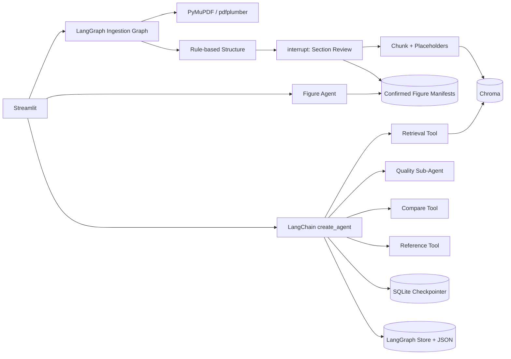
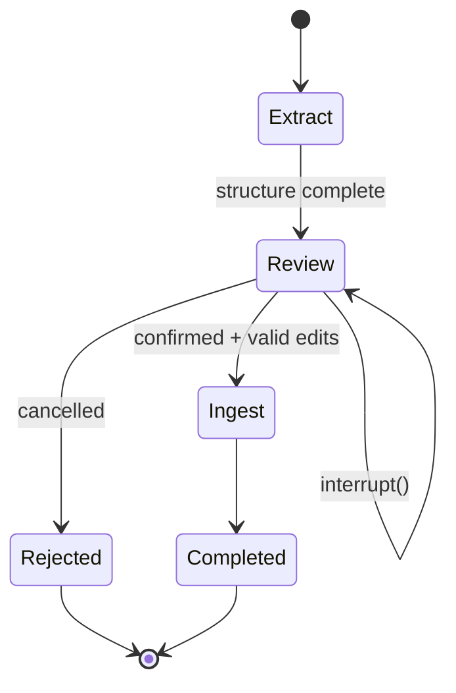

# 设计说明

## 1. 架构边界

`paper-agent/` 是独立 Python 应用，不导入也不修改现有 React、Tauri 或 Rust 模块。它通过本地文件、Chroma 和 SQLite 管理自己的状态，后续若需与桌面应用集成，可增加 HTTP/IPC 适配层，而无需改动论文处理核心。



## 2. 确定性逻辑与 LLM 边界

以下逻辑完全不调用 LLM：

- PDF 类型、大小、加密、空文件和文本层验证。
- 页眉页脚去重、软连字符清理、页码和图片块保留。
- 章节识别、层级计算、章节树构造和准确率计算。
- 图、表、公式检测、占位符生成、分片和 overlap。
- Chroma 写入、metadata filter、距离阈值和来源格式化。
- 质量信号匹配与四维分数聚合。
- 参考文献切分、字段启发式解析和格式一致性检查。
- 方法句、数据集、指标抽取与 Markdown 表格生成。

LLM 只负责：理解自然语言查询、选择工具、依据检索证据组织回答，以及对固定质量分数生成解释。服务层会覆盖空检索后的模型输出，因此“无证据不回答”不是只靠提示词保证。

## 3. PDF 抽取与清洗

`core/pdf_loader.py` 接受 path、bytes 或 file-like object：

1. 先检查空内容、`.pdf` 扩展名、大小和 `%PDF-` magic bytes。
2. 用 PyMuPDF `get_text("text", sort=True)` 抽取文本，`get_text("dict")` 记录图片 bbox。
3. 可见字符少于 80 时尝试 pdfplumber `extract_text(layout=True)`，仅在文本更多时采用兜底结果。
4. 两页以上文档统计每页前后两行；至少 50% 页面重复的短行视为页眉/页脚。
5. 删除 soft hyphen；仅对“行末 `-` + 下一行小写字母”做断词合并，避免破坏编号和公式。
6. 页面之间保留 `\f`，章节和 chunk 可由字符位置反推页码。

原生文本不足或章节结构明显不完整时，入库工作流调用 MineU CPU OCR；结果按 PDF SHA-256 缓存到 `runtime/mineru/`。MineU 的页码、bbox、图片路径、图注和文本位置会进入 HITL 状态。

## 4. 章节识别 B1

`tools/structure.py` 逐行处理，规则包括：

- 英文标准章节：Abstract、Introduction、Related Work/Background、Method(s)/Methodology/Model Architecture、Experiment(s)/Evaluation、Results、Discussion、Conclusion/Future Work、References/Bibliography。
- 中文标准章节：摘要、引言/绪论、相关工作/文献综述、方法/方法论、实验/评估、结果、讨论/局限、结论/展望、参考文献。
- 支持 `1 Introduction`、`2.1 Retrieval`、罗马数字和中文“一、引言/第一章”。数字点数决定层级。
- 通用编号标题要求标题长度、Title Case/中文字符和编号范围合理；图表 caption、目录点线、机构行、公式行会被过滤。
- 识别 References 后停止扫描，避免把参考文献编号误判为章节。

输出 `Section(title, level, char_start, page, canonical, number)`，再由栈算法生成树。B4 的准确率是：

```text
正确识别的预期核心章节类别数 / 预期核心章节类别总数
```

## 5. 分片与占位符 B2

默认 `CHUNK_SIZE=1200`、`CHUNK_OVERLAP=180`。1200 字符通常覆盖一个完整学术段落和必要上下文，180 字符约为 15%，可减少跨窗口论证断裂，同时不会让 Chroma 大量存储重复内容。

先按章节字符范围切开，再按页和空行形成段落，最后滑窗组合。超长单段使用固定步长切分。每个 chunk 保存章节、起止页、首段序号、字符范围和来源标签。

对象识别：

- Caption：`Figure/Fig./图` → `[FIGURE:id]`；`Table/表` → `[TABLE:id]`。
- LaTeX display/inline、等式特征行 → `[FORMULA:id]`。
- PyMuPDF image block → `[FIGURE:pN-imgM]`。

`ObjectPlaceholder` 单独保存 `kind/page/char_start/raw_text/bbox`，因此对象不是丢弃，而是文本检索与视觉内容之间的稳定引用点。

MineU 图片另外写入 `runtime/figures/<paper_id>.json`，记录真实资产路径、类型、完整图注、所属章节和前后正文。清单仅接受 `runtime/mineru/` 下的 JPG/PNG/WebP，避免被篡改后读取任意本地文件；公式截图进入图片清单，但分片继续使用公式文本占位，避免重复内容。

## 6. Chroma 与检索 B3

所有 chunk 进入统一 `paper_chunks` collection，以 `paper_id` metadata filter 隔离论文。写入使用 upsert；同一论文重入库前先删除旧条目，避免陈旧 chunk。

Embedding 后端：

- `local`：sentence-transformers，默认 `BAAI/bge-small-zh-v1.5`。
- `api`：OpenAI 兼容 embedding API。
- `hash`：确定性词袋哈希，只用于测试/显式降级。

Chroma 使用 cosine distance。`retrieve_paragraphs` 同时应用 top-k 和 `RETRIEVAL_MAX_DISTANCE`；结果带 paper、section、page/page_end、paragraph、chunk 和 placeholders。空结果返回空列表，主服务固定回答“不知道”。

## 7. Agent、工具和子 Agent

实现基于已安装版本的真实 API：LangChain 1.3.14、LangGraph 1.2.10。

```python
create_agent(
    model,
    tools=[...],
    middleware=[skill_prompt, token_stats],
    context_schema=AgentContext,
    checkpointer=SqliteSaver(...),
    store=InMemoryStore(),
)
```

主 Agent 工具：`retrieve_paper_passages`、`list_ingested_papers`、`get_reading_history`、`assess_quality`、`compare_indexed_papers`、`check_reference_format`。检索工具使用 `ToolRuntime[AgentContext]` 获取 active paper，并通过 `content_and_artifact` 把结构化 Passage 返回服务层。

Quality Agent 是另一个独立 `create_agent` 图。确定性代码先计算 methodology/data_support/innovation/clarity 的 1-5 分；子 Agent 只能根据 `[Q#]` 证据解释分数，不能改分。综合分是四项算术平均并保留两位小数。

Figure Agent 接收选定 MineU 图片、图注、章节和相邻正文。它先发送 OpenAI 兼容多模态消息；若供应商拒绝视觉输入，自动用同一文本证据重试，并把证据模式标为 `text_only`。两次失败才返回脱敏后的用户错误。

## 8. HITL 状态机



`PaperIngestionWorkflow` 用 Checkpointer 保存全文、章节和图片 metadata。`start()` 必然在 review 节点暂停；前端编辑后调用 `resume(Command(...))`。`ingest_paper` 本身还要求 `confirmed=True`；图片清单也只在 ingest 节点落盘，拒绝或未确认状态均为 0。

## 9. 多轮、会话与长期记忆

- `thread_id` 是 Checkpointer 会话键；相同 thread 保留 messages，不同 thread 不共享对话消息。
- `AgentContext` 同时携带 `user_id/session_id/active_paper_id`，工具不从全局 UI 状态猜当前论文。
- `LongTermMemory` namespace 为 `("users", normalized_user_id)`，记录论文、阅读次数、偏好和最近 100 个问题。
- 每次变更同步到 LangGraph Store，并原子替换 `runtime/memories.json`；应用重启后重新载入 Store。
- 长期记忆可跨 thread 注入 system prompt，但明确标注“不得作为论文事实证据”。这与对话隔离不冲突。

## 10. 流式与 Token 中间件

`stream_ask` 同时监听 LangGraph `messages` 和 `values`：messages 提供 AIMessageChunk，values 提供 ToolMessage artifact。发现空检索后，后续模型文本 chunk 被抑制，最后用固定未知回答替换；非空时逐 token 传给 Streamlit。

`@wrap_model_call` 优先读取 `AIMessage.usage_metadata` 的 input/output token；不支持 usage 的兼容端点才按 CJK 字符 + 其他字符/4 估算，并增加 `estimated_calls`。数据按 session_id 加锁累计，前端显示 prompt、completion、调用数和总耗时。

## 11. 安全与失败边界

- 配置只从环境读取；Key 不进入持久化对象。
- UI 捕获已知业务错误，未知错误显示固定提示，不渲染 traceback。
- 文件名转换为内容哈希 paper_id，上传路径不使用原始相对路径。
- 修正章节必须标题非空、level 1-5、page ≥1、char_start 合法且严格递增。
- Chroma、上传、记忆和 checkpoint 目录全部 gitignore。

## 12. 已知限制

- 双栏 PDF 的阅读顺序依赖 PyMuPDF `sort=True`，复杂排版可能需要版面模型。
- 图片像素点评依赖供应商的视觉能力；文本模型会明确降级为 MineU 图注、章节和相邻正文证据。
- 参考文献字段解析是规则启发式，不等同于 Crossref/GROBID 的完整书目解析。
- 默认 Store 是内存索引 + JSON 持久副本，适合单机课程项目；多进程部署应换成共享数据库 Store。
